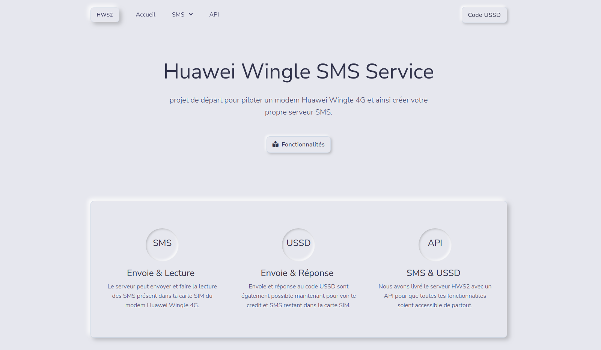

# Build with NodeJS, Express & EJS view engine

## About

A simple project to drive a Huawei Wingle modem and a base to create your own SMS server.
No need a documentation, just view the code.

## Installation
* Clone this repo: ``` git clone https://github.com/bhanushalimahesh3/node-website.git ```
* Install dependencies using [npm](https://www.npmjs.com/) javascript package manager: ``` npm install ```
* Start node server with [nodemon](https://nodemon.io/): ``` nodemon start ```
* Tune to url: ``` http://localhost:3000 ```


## Screenshot

